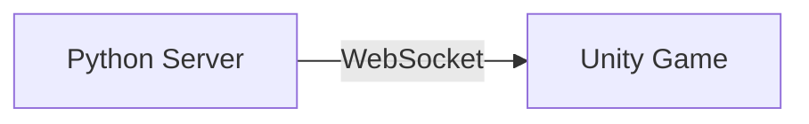
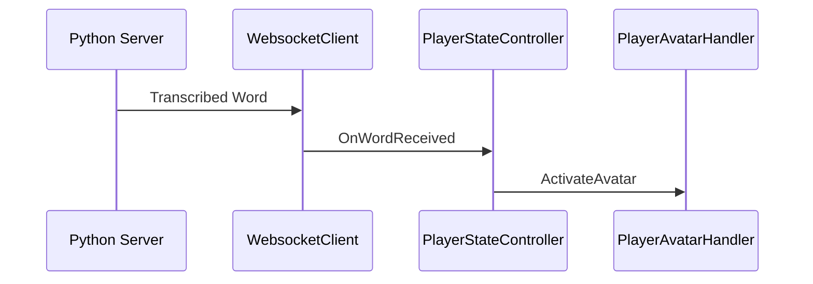


# Voice-Controlled Unity Game with Real-Time Speech Recognition

A Unity game that listens for specific food-related words and instantly displays corresponding 3D models using real-time speech recognition. Powered by a Python WebSocket server and ScriptableObject-based food configuration.


## Demo Video
[](https://youtu.be/xzN17zT2pTU)

## Project Architecture


---

## Features
- Voice-controlled game transformations
- Real-time WebSocket communication
- Thread-safe network handling
---

## Requirements
- Unity 6.0+
- Python 3.7+ (for server)
- Microphone-enabled hardware

---

## Setup Guide

### 1. Clone Repositories
```bash
# Speech Server
git clone https://github.com/payam-ranjbar/Speech-Transfer-Socket

# Unity Game
git clone https://github.com/payam-ranjbar/Speech-Mania-Game
```

### 2. Server Setup
```bash
cd Speech-Transfer-Socket
pip install -r requirements.txt
python websocket_server.py
```

### 3. Game Configuration
1. Open Unity project
2. Ensure WebSocket URL is `ws://localhost:8765` in: `WebsocketClient.cs`
---

## Voice Command System

### Key Script Interactions

